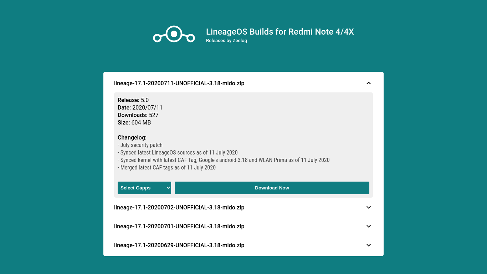

# zeebuilds
friendly download page for zeelog builds | built with vanilla web stuff

# Highlights
 - GApps downloader
 - Lightweight (no third party libs or frameworks)
 - Beautiful and Responsive
 - Always updated (github & opengapps api integrated)

# Deploys:
[Github](https://andersonmendess.github.io/zeebuilds/), [Vercel](https://zeebuilds.vercel.app/)

# Preview

